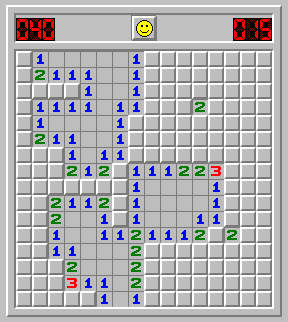

# Minesweeper
- - - -

You most likey know the game Minesweeper, even better if you played it before. For those who are new to it, heres a picture - 

Check this link to know [how to play](http://www.wikihow.com/Play-Minesweeper)

### Project Requirement:
- - - -
* Implement the complete game using appropriate algorithms. (You can make your own algorithm, but must be efficient and fast)
* Must have a proper scoring scheme defined by you (can also follow the default one).
* Allowed languages
*	C++, Java
*	Python, Javascript, PHP
*	Other (inform first)
* Project report:
*	Mention in detail about any extra features you added, if any.
*	Must include detail explanation of your algorithms.
*	Must include short description of all major functions/classes.

