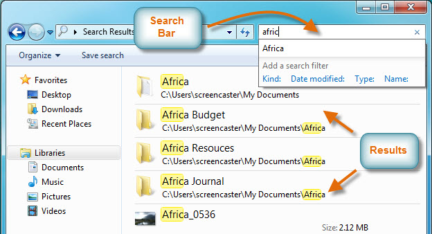
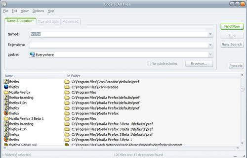
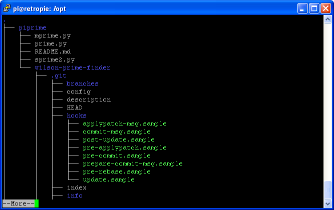

# File System Search
- - - -
This is a very common thing for people who uses computer on a regular basis and has lots of files in the disk. Its not always possible to remember exactly where you kept all your files, thus we need a program which will do that for us in a very smart and efficient way. Heres some picture of classical tool for searching files - 

|  |  | 

Heres a [demo](https://www.youtube.com/watch?v=bRAoi32vakM) of a very specialized search program.

Hint: You will need to know more about **DFS**, theres bunch of [videos](https://www.youtube.com/results?search_query=depth+first+search) on it out there, check those out. 

### Project Requirement:
- - - -
* The search **keyword** can be any part of the file/folder name. The search must include both **files** and **folders**.
* Use efficient algorithm for **pattern matching**.
* **Bonus**: Allow [regular expression](http://www.regular-expressions.info/tutorial.html) for the search **keyword**. Will confirm at least **80%** mark for your project.
* **Highlight** all the **matched portion** of the file/folder names.
* Show a summary of the search when its complete, at the bottom.
* Project report:
    * Mention in detail about any extra features you added, if any.
    * Must include detail explanation of your algorithms.
    * Must include short description of all major functions/classes.
    * Must include detail of the pattern matching scheme.
