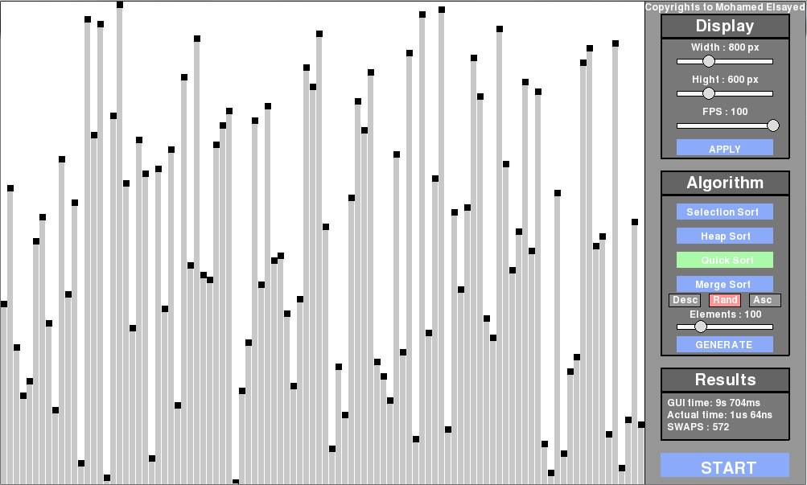

# Merge Sort Visualization
- - - - 
Sorting is one of the fundamental algorithms in computer science, there are different kinds of sorting algorithms with variying efficiency and time complexity. Among those Merge Sort is one of the best with a stable time complexity of O(*nlogn*). Heres couple of picture showing sorting visulaizaton -

|  | 
-----------------------------------------------------|-----------------------------------
> Courtesy
> > Mohamed Elsayed

More about Merge Sort [here](https://en.wikipedia.org/wiki/Merge_sort).

### Project Requirement:
- - - -
* Must implement and visulaize each step of the **Merge Sort** algorithm.
* Must have a GUI interface similar to the sample pictures.
* Allowed languages
    * C++, Java
    * Python, JavaScript, PHP
* Project report:
    * Mention in detail about any extra features you added, if any.
    * Must include detail explanation of your algorithms.
    * Must include short description of all major functions/classes.
    * Describe in brief your approach to visualize it.