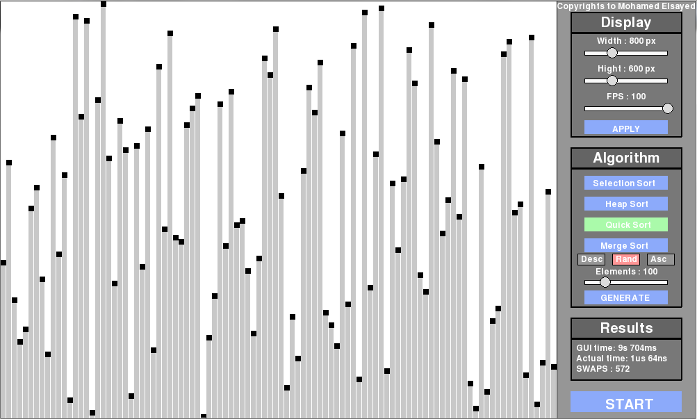
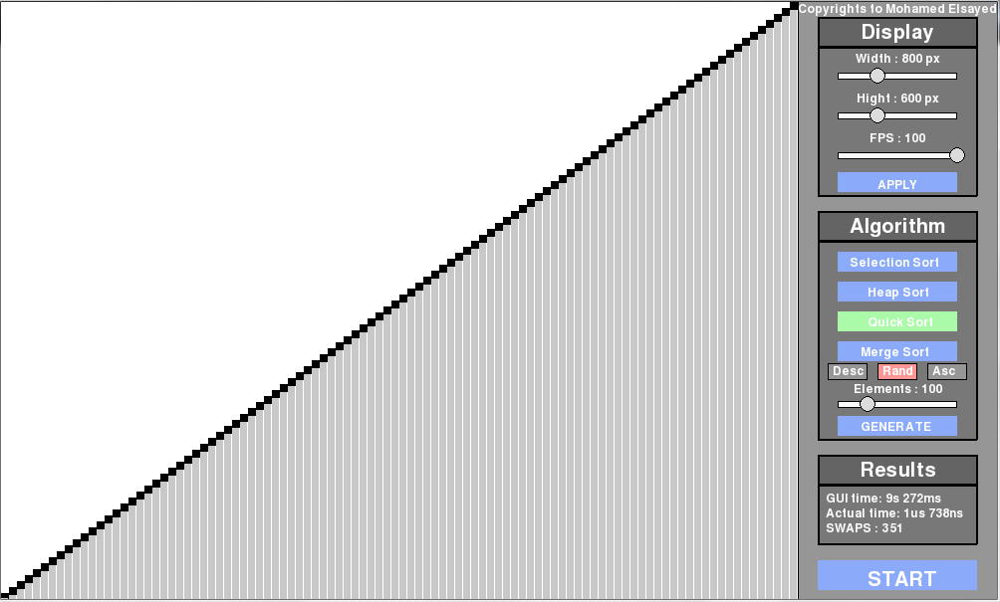

# Quick Sort Visualization
- - - - 
Sorting is one of the fundamental algorithms in computer science, there are different kinds of sorting algorithms with variying efficiency and time complexity. Among those Quick Sort is one of the best with a time complexity of O(n^2). Though its time complexity is O(n^2), in practical its better than Merge Sort. Heres couple of picture showing sorting visulaizaton -

|  | 
-----------------------------------------------------|-----------------------------------
> Courtesy
> > Mohamed Elsayed

More about Quick Sort [here](https://en.wikipedia.org/wiki/Quicksort).

### Project Requirement:
- - - -
* Must implement and visulaize each step of the **Quick Sort** algorithm.
* Must have a GUI interface similar to the sample pictures.
* Allowed languages
    * C++, Java
    * Python, JavaScript, PHP
* Project report:
    * Mention in detail about any extra features you added, if any.
    * Must include detail explanation of your algorithms.
    * Must include short description of all major functions/classes.
    * Must include detail about the partition algorithm used.
	* Describe in brief your approach to visualize it.
