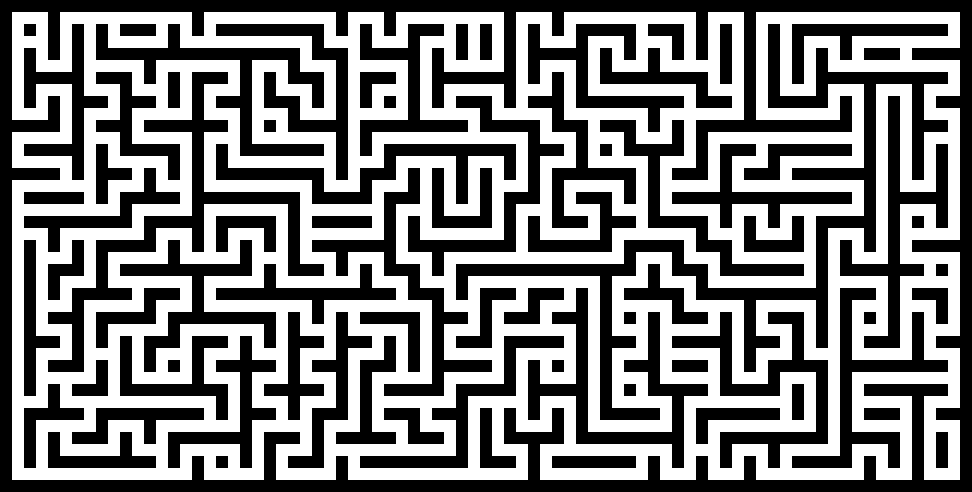

# Maze Solver
- - - -
We all know what a maze is, its something mysterious and scary, none of us wants to get stuck in one, we always want a way out from there. But its not always easy to find your way out of a maze, it requires lots of ground work and you need to know the complete layout of the maze. Lets look at a scary maze - 

Heres a very nice [demo](http://www.primaryobjects.com/maze/) of a maze solver, check this out.

### Project Requirement:
- - - - 
* You must implement your own random **Maze Generator**.
* Given a **starting point** and an **exit point** in the maze, your **Maze Solver** algorithm must find a possible route from starting to exit.
* You must implement at least **3** different **Maze Solver** algorithm to find a possible solution. Adding more than **3** will get you bonus mark.
* You must **visuliaze the path** that the algorithm is traversing to find the exit point. (Similar to the demo given, but you can have your own style)
* Must have a way to **store the maze to a file** after generating it, so that it can be **loaded later from the file**.
* Allowed languages
    * C++, Java
    * Python, JavaScript, PHP
    * Other (inform first)
* Project report:
    * Mention in detail about any extra features you added, if any.
    * Must include detail explanation of your algorithms.
    * Must include short description of all major functions/classes.
    * Must include detail of the maze generator scheme.
    * Must include detail of the maze storing scheme.
