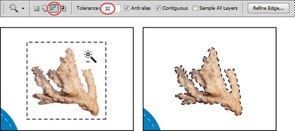

# Photoshop Magic Wand Tool
- - - -
Adobe Photoshop is the brand photo editor out there, its hard to find a product with similar efficiency as this. One of the crucial tool that is part of Adobe Photoshops basic tool set is the **Magic Wand Tool**, you cannot imagine editing photos without this tool. Heres some sample photo - 

  |  |  
-----------------------------------------------------|-------------------------------------|-------------------------------------

Heres a [YouTube video](https://www.youtube.com/watch?v=xzq_HWdvwn0) showing in detail the use of Magic Wand Tool.

Hint: You need to know about [graph representaion](https://www.khanacademy.org/computing/computer-science/algorithms/graph-representation/a/representing-graphs) and [graph traversal](https://www.khanacademy.org/computing/computer-science/algorithms/breadth-first-search/a/the-breadth-first-search-algorithm) to figure out how to implement your own **Magic Wand Tool**.

### Project Requirement:
- - - - 
* You have to implement a mini [**Paint**](https://en.wikipedia.org/wiki/Microsoft_Paint) program.
* The program must be able to **load an image** and use the **Magic Wand Tool** on it.
* You also need to implement the [**paint brush**](http://www.getpaint.net/doc/latest/Paintbrush.html) tool to allow drawing of different colors on the canvas.
* Try to make it as similar as the real **Magic Wand Tool**, the more feature you add it will have more bonus marks for it.
* After editing is done we must be able to **save** the edited image.
* Allowed languages
    * C++, Java
    * Python, JavaScript, PHP
    * Other (inform first)
* Project report:
    * Mention in detail about any extra features you added, if any.
    * Must include detail explanation of your algorithms.
    * Must include short description of all major functions/classes.
    * Must include detail of the program interface.
    * Must include detail of the image load/storing process.
