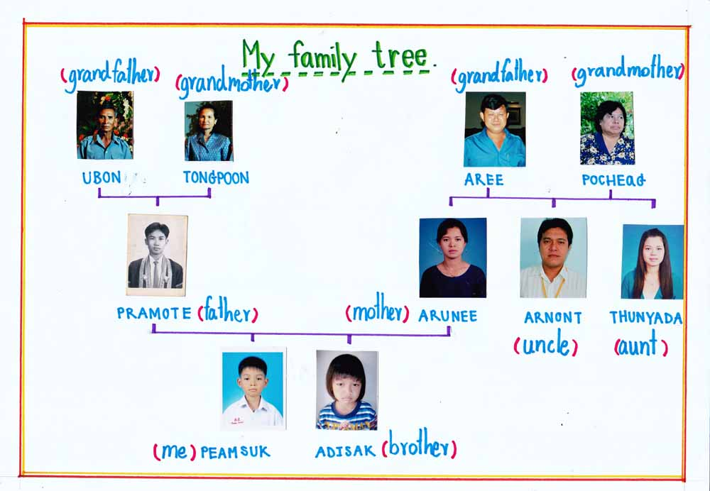
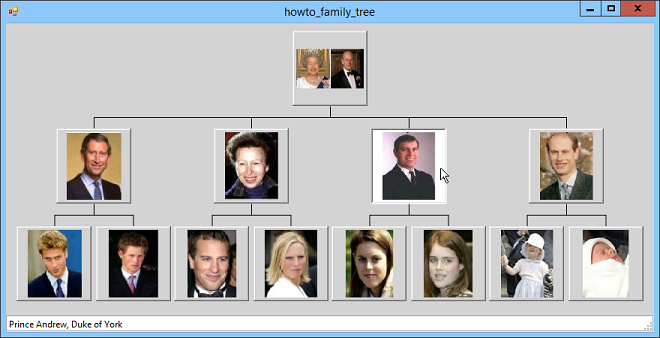
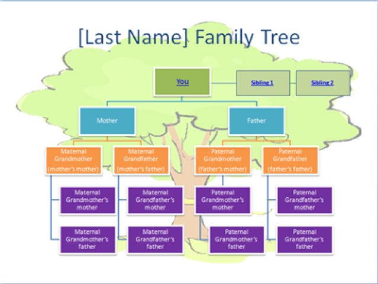

# Family Tree
- - - -
Families are the basic unit of a Society. Its not only that, it gives every individual a sense of identity, gives them a unique origin. To know yourself better sometimes it is necessary to search for your roots. Lets see some family trees - 

|  |  | 
------------------------------------------------|----------------------------------------------|-------------------------------
> > Source: Google

More about [Family Tree](https://en.wikipedia.org/wiki/Family_tree).

### Project Requirement:
- - - - 
* Must be able to build a family tree from scratch. 
* The program must be data persistent, meaning must be able to store the family tree to a file to later load the same family tree again. 
* We must be able to ask questions like, "Who are X's first cousins?", "Who are X's grandparents?", "Who are X's siblings?" etc.
* You must include as many relations possible into the tree. More and unique relations will have bonus marks.
* **Graphical visualization** is not mandatory but much expected. Will ensure **70%** marks right away, given that its correct.
* Must have a proper way of representing the answers to the question. You can design your own format of asking question.
* Allowed languages
	* C++, Java
	* Python, JavaScript, PHP
	* Other (inform first)
* Project report:
    * Mention in detail about any extra features you added, if any.
    * Must include detail explanation of your algorithms.
    * Must include short description of all major functions/classes.
    * Must include detail of the data storage scheme.
	* Must include detail of the format of the accepted questions to the system.
