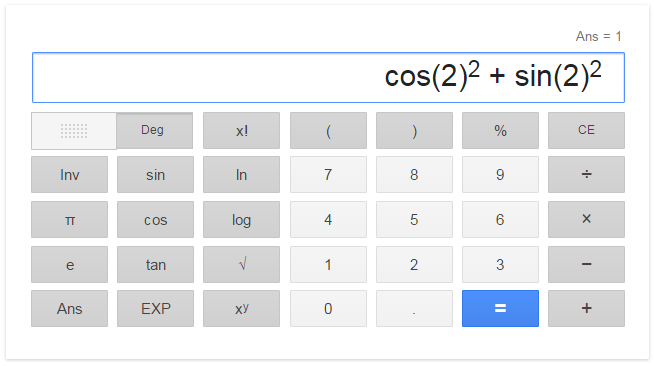

# Scientific Calculator
- - - -
A must needed tool for mathematicians and others alike. Because of increasing computational power, it is now possible to implement very advanced scientific calculators. Heres a picture of a very simple and plain scientific calculator by Google - 

A [demo](http://www.javascriptkit.com/script/cut42.shtml) of a very simple normal calculator.

### Project Requirement:
- - - - 
* Must at least inlcude all operation present in the **Google Calculator**.
* If you add extra unique features then there will be **bonus** marks.
* **Bonus**: store at least 10 previous calculations to view later.
* Allowed languages:
	* C++, Java
	* Python, JavaScript, PHP
	* Other (inform first)
* Project report:
	* Mention in detail about any extra features you added, if any.
    * Must include detail explanation of your algorithms.
    * Must include short description of all major functions/classes.
